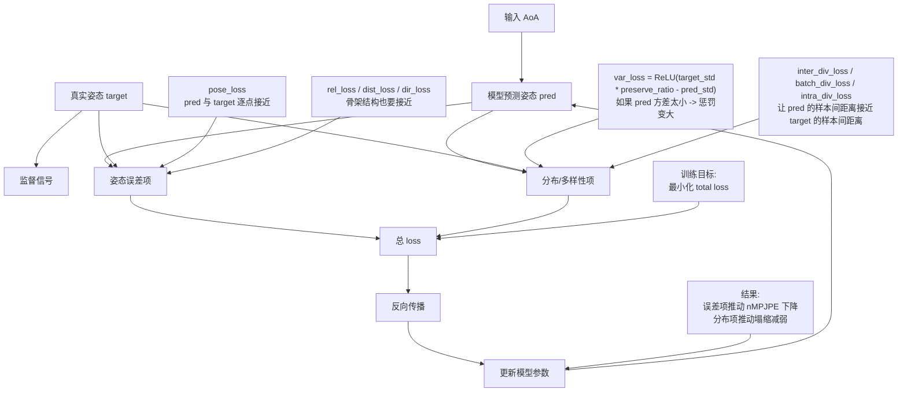

# 优化原理图



## 关键公式

```text
total_loss =
  lambda_pose * pose_loss
  + lambda_rel * rel_loss
  + lambda_dist * dist_loss
  + lambda_dir * dir_loss
  + lambda_var * var_loss
  + lambda_batch_div * batch_div_loss
  + lambda_inter_div * inter_div_loss
  + lambda_intra_div * intra_div_loss
```

## 你现在这份代码里，variance 是怎么“被优化”的

不是直接“把 variance 变大”，而是最小化下面这个惩罚：

```text
var_loss = ReLU(target_std * preserve_ratio - pred_std)
```

- 当 `pred_std` 太小，`var_loss` 变大，模型就会被梯度推动去增大输出方差。
- 当 `pred_std` 已经不低于阈值，`var_loss` 变成 0，不再继续硬推方差变大。

所以它本质上是“防塌缩约束”，不是“无限追求更大方差”。

## inter_div 为什么也能防塌缩

`inter_div_loss` 不是直接最大化距离，而是让：

```text
预测的不同动作样本间距离  ≈  真实的不同动作样本间距离
```

- 如果不同动作的预测太像，`inter_div_loss` 会变大。
- 最小化它后，模型会把不同动作拉开。
- 但如果拉得过头，和真实分布不一致，loss 也会重新变大。

## 训练和选 checkpoint 是两件事

- 训练时：优化的是 `total_loss`
- 选 checkpoint 时：`diversity_first` 用的是验证集评分  

```text
score = pair_ratio + 0.35 * std_ratio + 0.15 * inter_pair_ratio - 0.02 * val_nmpjpe
```

所以：
- `loss` 决定模型怎么学
- `selection score` 决定训练完以后保留哪一轮
